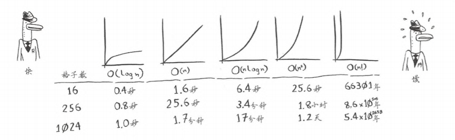

## 算法图解

> 参考：[grokking_algorithms](https://github.com/egonSchiele/grokking_algorithms)

### 常见时间复杂度
|时间复杂度|描述|
|:---------|:---------|
|O(㏒n)|对数时间，比如二分查找算法 [BinarySearch](src/BinarySearch.java)|
|O(n)|线性时间，比如简单查找算法|
|O(n * ㏒n)|比如快速排序——一种速度较快的排序算法 |
|O(n²)|比如选择排序——一种速度较慢的排序算法 [SelectionSort](src/SelectionSort.java)|
|O(n!)|比如旅行商问题——一种非常慢的算法|

### 测试 develop merge feature

### 测试 feature 分支
### 测试 feature 分支2
### 测试 feature 分支3

### hotfix
### hotfix2
### hotfix3
### I'm master
### I'm master2